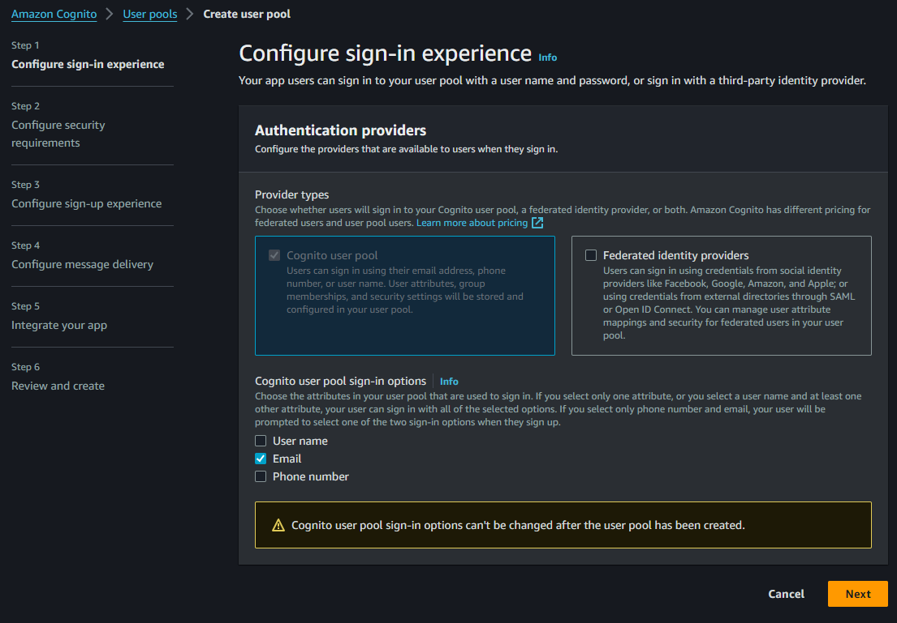
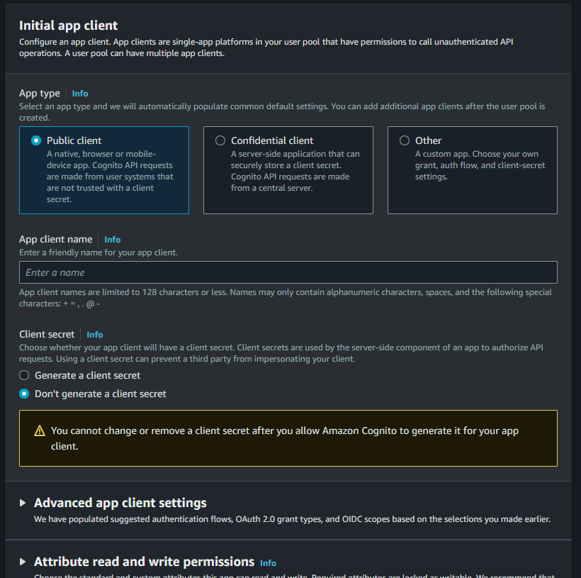
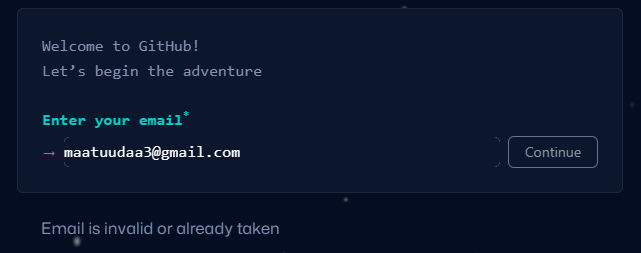
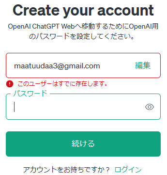
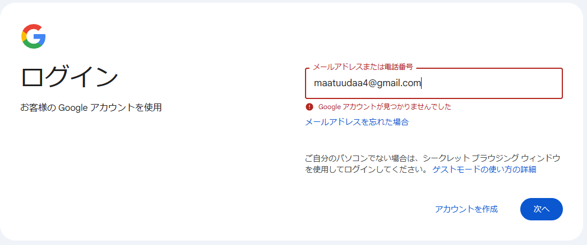
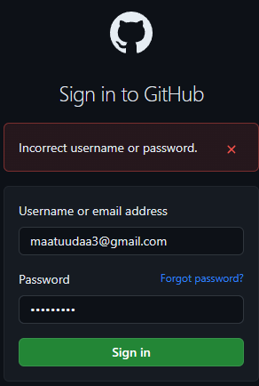
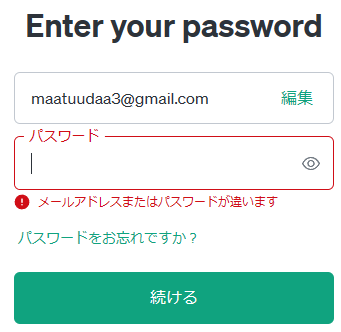
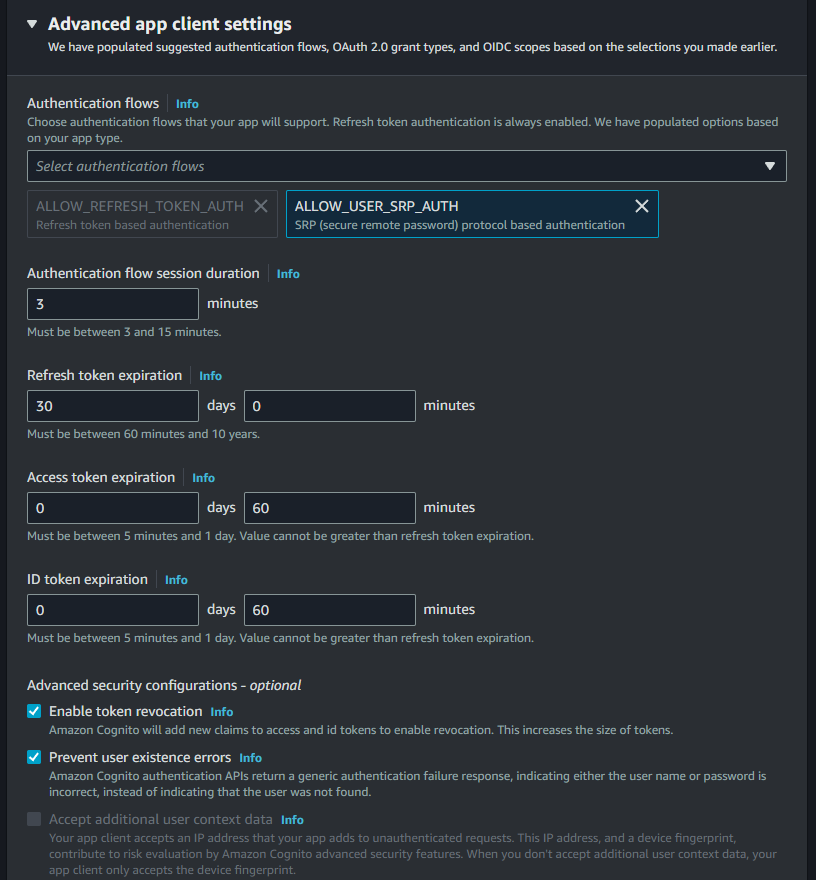
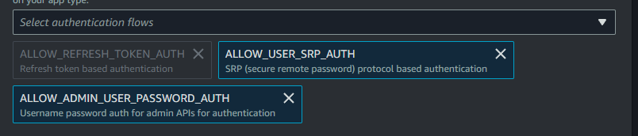

# Amazon Cognito

Amazon Cognito と格闘したメモです。
SPA での利用を考えており、Vue から直接認証を行うつもりです。
Cognito を使うことで、ユーザの認証用のエンドポイントやデータベースの実装の簡略化を狙います。

## まずは普通に使う {#normal-use}

基本的にステップに従う形で設定しましたが、

email のみでログインするように設定し、(Step 1)



app client はクライアントシークレットを持たない設定で作成しました。(Step 5)



Vue からは[`amazon-cognito-identity-js`](https://www.npmjs.com/package/amazon-cognito-identity-js) を使ってログインを行いました。
ユースケースとして書かれているサンプルコードを参考にすれば実装できるので、実装の詳細は割愛します。

これで、Vue などのクライアントから Sign Up, Sign In, Sign Out など、基本的なことはできるようになります。

## サインアップ

!!! Note
    ここから Cognito の挙動を確認していきますが、クライアントの実装が面倒なので AWS CLI を使って確認操作を行います。
    Vue を使っても同じ挙動・エラーが返されます。

Cognito のユーザの Sign Up のフローは以下のようになっています。
メールアドレスやパスワードを登録すると、メールが送信され、そのメールに記載されたコードを入力することでユーザが登録されます。


ユーザ`hoge`さんが自分のメールアドレスを使って Sign Up します。（`Sign-up`の手続き）

```powershell
aws cognito-idp sign-up --client-id 1234567890abcdef0 --password Password1! --user-attributes Name="email",Value="hoge@example.com" --username hoge@example.com
```

登録が完了した時点では、ユーザは`Registered(Unconfirmed)`状態です。
確認コードを入力します。(`Confirm via email/phone`の手続き)

```powershell
aws cognito-idp confirm-sign-up --client-id 1234567890abcdef0 --confirmation-code 123456 --username hoge@example.com
```

これでユーザ`hoge`さんが登録されました。`Confirmed`状態です。

## 既に存在するメールアドレスでのサインアップ {#sign-up-with-existing-email}

登録されているメールアドレスでサインアップを行った場合の挙動を確かめてみましょう。
`Sign-up`の手続きを行います。

```powershell
aws cognito-idp sign-up --client-id 1234567890abcdef0 --password Password1! --user-attributes Name="email",Value="hoge@example.com" --username hoge@example.com
```

すると、以下のエラーが発生します。

```
An error occurred (UsernameExistsException) when calling the SignUp operation: An account with the given email already exists.
```

サインアップはできませんでしたが、既にこのメールアドレスが登録されていることがエラーメッセージから確認できます。

これが悩みの種です。
サインアップの API でユーザの存在が確認できてしまってよいのでしょうか？
新卒で受けた研修では、ユーザの存在がわかるエラーを返してはいけないと教わりました。

## 世間一般での挙動

GitHub で確認したところ、サインアップ画面でメールアドレスを入力すると、そのメールアドレスが存在する旨が表示されました。



ChatGPT でも同様です。ユーザが MFA をしっかり設定できている前提なら、セキュリティ面はそんなに気にしなくてもいいのか...？



徳丸浩さんが書いた[安全なWebアプリケーションの作り方](https://www.amazon.co.jp/%E4%BD%93%E7%B3%BB%E7%9A%84%E3%81%AB%E5%AD%A6%E3%81%B6-%E5%AE%89%E5%85%A8%E3%81%AAWeb%E3%82%A2%E3%83%97%E3%83%AA%E3%82%B1%E3%83%BC%E3%82%B7%E3%83%A7%E3%83%B3%E3%81%AE%E4%BD%9C%E3%82%8A%E6%96%B9-%E7%AC%AC2%E7%89%88-%E8%84%86%E5%BC%B1%E6%80%A7%E3%81%8C%E7%94%9F%E3%81%BE%E3%82%8C%E3%82%8B%E5%8E%9F%E7%90%86%E3%81%A8%E5%AF%BE%E7%AD%96%E3%81%AE%E5%AE%9F%E8%B7%B5-%E5%BE%B3%E4%B8%B8/dp/4797393165)では、Google のサインイン画面について取り上げています。
Googleのサインインは、メールアドレスの確認の後、パスワードの確認を行うようになっており、メールアドレスが存在しない場合エラーを返します。



それについて、徳丸さんは以下のように書いています。

> ユーザ登録されていないIDの場合は以下のようにエラーになります。すなわち、パスワードを正当しなくても、特定のIDがGoogleにユーザ登録されているか否かは分かるわけです。「従来のセキュリティの常識」には反するものですが、ログイン操作自体はやりやすくなります。（中略）米国の大手サイトを中心に最近この種のログイン画面が増えています。

ユーザビリティの向上のために、メールアドレスの存在を明らかにしているわけですね。
最近は MFA でユーザアカウントのセキュリティを確保することが重視されています。
きちんと MFA を利用しているならメールアドレスのの存在有無がわかっても問題ないのかもしれません。

徳丸さんの本ではサインインについて書かれていましたが、サインアップについても同様のことが言えると思います。

と思いましたが、GitHub と ChatGPT のログイン画面は「従来のセキュリティの常識」に従って、メールアドレスとパスワードのどちらが間違っているかはわからないエラーが返されていました。
サインイン画面ではユーザの存在がわからないエラーを返しているのに、サインアップ画面では存在がわかるエラーを返しているのは何故なのでしょうね。
ユーザ存在エラーにこだわらない形でセキュリティを担保する仕組みを整えるのが一般的になっているのかもしれません。




!!! Note
    ちなみにAmazon Cognitoのデフォルト設定では、サインイン時についてはメールアドレスとパスワードのどちらを間違えていたかはわからないエラーが返されます。
    サインインのエラーは「従来のセキュリティの常識」に従っているようです。
    この挙動は App Client の設定 "Prevent user existence errors"から変更できます。
    チェックを外すと、メールアドレスが存在しない旨がエラーに表示されるようになります。
    この設定はサインアップとは関係ありません。
    [（参考）](https://docs.aws.amazon.com/cognito/latest/developerguide/cognito-user-pool-managing-errors.html)
       

## UsernameExistsException の回避方法

それでは、UsernameExistsException を回避する方法はないのでしょうか。

二つの方法で回避することができます。

1. Cognito へ認証用のリクエストを送るバックエンドを実装し、Vue からはそのバックエンドを経由して Cognito にリクエストを送る
2. Cognito のサインイン属性を Alias Attribute にする

1 はせっかく Cognito で認証周りの実装を楽にしようとしているのに、本末転倒という感じがします。
何かしら認証周りでカスタマイズが必要な場合はこの方法が有意義だとは思いますが、今回は避けたいです。

2 は Alias Attribute って何？という感じですよね。
AWS の Web UI では Alias Attribute を設定するための項目はありません。
いえ、あるにはあるのですが、Web UI では **Alias Attribute** という名前で表現されていないのです。

## Username Attributes と Alias Attributes

ここでは、Amazon Cognito の二つのサインイン属性について説明します。
公式ドキュメントでは、[ログイン属性のカスタマイズ - ユーザプール属性](https://docs.aws.amazon.com/ja_jp/cognito/latest/developerguide/user-pool-settings-attributes.html#user-pool-settings-aliases)に詳しく書かれています。
しかし、実際に Cognito を構築したり、設定の内容を確認しないと理解が難しいと思います。
ここでは、Cognito の挙動を確認しながら Username Attributes と Alias Attributes について説明します。

### Username Attributes

#### Username Attributes の設定 {#username-attributes-settings}

[先ほど](#normal-use) Amazon Cognito のユーザプールを作成した際、 email のみでログインするように設定しました。


実はこの設定によって、ログイン属性は Username Attributes に決まりました。
このチェックボックスへのチェックの方法で Username Attributes か Alias Attributes のどちらかが設定されます。

Username Attributes が設定されていることを、AWS CLI で確認します。
ユーザプール一覧を確認し、詳細を知りたい User Pool の ID を取得します。

```powershell title="ユーザプール一覧確認コマンド"
aws cognito-idp list-user-pools --max-results 20
```

```json title="結果" hl_lines="4"
{
    "UserPools": [
        {
            "Id": "ap-northeast-1_XXXXXXXXX",
            "Name": "HogeUserPool",
            "LambdaConfig": {},
            "LastModifiedDate": "2024-03-25T21:22:34.748000+09:00",
            "CreationDate": "2024-03-25T21:22:34.748000+09:00"
        }
    ]
}
```

ID を使って詳細を取得します。

```powershell title="ユーザプール詳細確認コマンド"
aws cognito-idp describe-user-pool --user-pool-id ap-northeast-1_XXXXXXXXX
```

```json title="結果（全文）" hl_lines="130-140 235-237"
{
  "UserPool": {
    "Id": "ap-northeast-1_XXXXXXXXX",
    "Name": "HogeUserPool",
    "Policies": {
      "PasswordPolicy": {
        "MinimumLength": 8,
        "RequireUppercase": true,
        "RequireLowercase": true,
        "RequireNumbers": true,
        "RequireSymbols": true,
        "TemporaryPasswordValidityDays": 7
      }
    },
    "DeletionProtection": "ACTIVE",
    "LambdaConfig": {},
    "LastModifiedDate": "2024-03-25T21:22:34.748000+09:00",
    "CreationDate": "2024-03-25T21:22:34.748000+09:00",
    "SchemaAttributes": [
      {
        "Name": "sub",
        "AttributeDataType": "String",
        "DeveloperOnlyAttribute": false,
        "Mutable": false,
        "Required": true,
        "StringAttributeConstraints": {
          "MinLength": "1",
          "MaxLength": "2048"
        }
      },
      {
        "Name": "name",
        "AttributeDataType": "String",
        "DeveloperOnlyAttribute": false,
        "Mutable": true,
        "Required": false,
        "StringAttributeConstraints": {
          "MinLength": "0",
          "MaxLength": "2048"
        }
      },
      {
        "Name": "given_name",
        "AttributeDataType": "String",
        "DeveloperOnlyAttribute": false,
        "Mutable": true,
        "Required": false,
        "StringAttributeConstraints": {
          "MinLength": "0",
          "MaxLength": "2048"
        }
      },
      {
        "Name": "family_name",
        "AttributeDataType": "String",
        "DeveloperOnlyAttribute": false,
        "Mutable": true,
        "Required": false,
        "StringAttributeConstraints": {
          "MinLength": "0",
          "MaxLength": "2048"
        }
      },
      {
        "Name": "middle_name",
        "AttributeDataType": "String",
        "DeveloperOnlyAttribute": false,
        "Mutable": true,
        "Required": false,
        "StringAttributeConstraints": {
          "MinLength": "0",
          "MaxLength": "2048"
        }
      },
      {
        "Name": "nickname",
        "AttributeDataType": "String",
        "DeveloperOnlyAttribute": false,
        "Mutable": true,
        "Required": false,
        "StringAttributeConstraints": {
          "MinLength": "0",
          "MaxLength": "2048"
        }
      },
      {
        "Name": "preferred_username",
        "AttributeDataType": "String",
        "DeveloperOnlyAttribute": false,
        "Mutable": true,
        "Required": false,
        "StringAttributeConstraints": {
          "MinLength": "0",
          "MaxLength": "2048"
        }
      },
      {
        "Name": "profile",
        "AttributeDataType": "String",
        "DeveloperOnlyAttribute": false,
        "Mutable": true,
        "Required": false,
        "StringAttributeConstraints": {
          "MinLength": "0",
          "MaxLength": "2048"
        }
      },
      {
        "Name": "picture",
        "AttributeDataType": "String",
        "DeveloperOnlyAttribute": false,
        "Mutable": true,
        "Required": false,
        "StringAttributeConstraints": {
          "MinLength": "0",
          "MaxLength": "2048"
        }
      },
      {
        "Name": "website",
        "AttributeDataType": "String",
        "DeveloperOnlyAttribute": false,
        "Mutable": true,
        "Required": false,
        "StringAttributeConstraints": {
          "MinLength": "0",
          "MaxLength": "2048"
        }
      },
      {
        "Name": "email",
        "AttributeDataType": "String",
        "DeveloperOnlyAttribute": false,
        "Mutable": true,
        "Required": true,
        "StringAttributeConstraints": {
          "MinLength": "0",
          "MaxLength": "2048"
        }
      },
      {
        "Name": "email_verified",
        "AttributeDataType": "Boolean",
        "DeveloperOnlyAttribute": false,
        "Mutable": true,
        "Required": false
      },
      {
        "Name": "gender",
        "AttributeDataType": "String",
        "DeveloperOnlyAttribute": false,
        "Mutable": true,
        "Required": false,
        "StringAttributeConstraints": {
          "MinLength": "0",
          "MaxLength": "2048"
        }
      },
      {
        "Name": "birthdate",
        "AttributeDataType": "String",
        "DeveloperOnlyAttribute": false,
        "Mutable": true,
        "Required": false,
        "StringAttributeConstraints": {
          "MinLength": "10",
          "MaxLength": "10"
        }
      },
      {
        "Name": "zoneinfo",
        "AttributeDataType": "String",
        "DeveloperOnlyAttribute": false,
        "Mutable": true,
        "Required": false,
        "StringAttributeConstraints": {
          "MinLength": "0",
          "MaxLength": "2048"
        }
      },
      {
        "Name": "locale",
        "AttributeDataType": "String",
        "DeveloperOnlyAttribute": false,
        "Mutable": true,
        "Required": false,
        "StringAttributeConstraints": {
          "MinLength": "0",
          "MaxLength": "2048"
        }
      },
      {
        "Name": "phone_number",
        "AttributeDataType": "String",
        "DeveloperOnlyAttribute": false,
        "Mutable": true,
        "Required": false,
        "StringAttributeConstraints": {
          "MinLength": "0",
          "MaxLength": "2048"
        }
      },
      {
        "Name": "phone_number_verified",
        "AttributeDataType": "Boolean",
        "DeveloperOnlyAttribute": false,
        "Mutable": true,
        "Required": false
      },
      {
        "Name": "address",
        "AttributeDataType": "String",
        "DeveloperOnlyAttribute": false,
        "Mutable": true,
        "Required": false,
        "StringAttributeConstraints": {
          "MinLength": "0",
          "MaxLength": "2048"
        }
      },
      {
        "Name": "updated_at",
        "AttributeDataType": "Number",
        "DeveloperOnlyAttribute": false,
        "Mutable": true,
        "Required": false,
        "NumberAttributeConstraints": {
          "MinValue": "0"
        }
      }
    ],
    "AutoVerifiedAttributes": [
      "email"
    ],
    "UsernameAttributes": [
      "email"
    ],
    "VerificationMessageTemplate": {
      "DefaultEmailOption": "CONFIRM_WITH_CODE"
    },
    "UserAttributeUpdateSettings": {
      "AttributesRequireVerificationBeforeUpdate": [
        "email"
      ]
    },
    "MfaConfiguration": "OFF",
    "EstimatedNumberOfUsers": 0,
    "EmailConfiguration": {
      "EmailSendingAccount": "COGNITO_DEFAULT"
    },
    "UserPoolTags": {},
    "AdminCreateUserConfig": {
      "AllowAdminCreateUserOnly": false,
      "UnusedAccountValidityDays": 7
    },
    "UsernameConfiguration": {
      "CaseSensitive": false
    },
    "Arn": "arn:aws:cognito-idp:ap-northeast-1:XXXXXXXXXXXX:userpool/ap-northeast-1_XXXXXXXXX",
    "AccountRecoverySetting": {
      "RecoveryMechanisms": [
        {
          "Priority": 1,
          "Name": "verified_email"
        }
      ]
    }
  }
}
```

この User Pool の設定から、UsernameAttributes が設定されていることがわかります。
UsernameAttributes は、ユーザ名として使う属性を指定するものです。
この場合、email が指定されているので、email がユーザ名として使われていることがわかります。

```json title="結果（UsernameAttributes 部分抜粋）"
{
  "UsernameAttributes": [
    "email"
  ]
}
```

また、email は必須設定になっていることもわかります。

```json title="結果（SchemaAttributes 部分抜粋）"
{
  "SchemaAttributes": [
    {
      "Name": "email",
      "AttributeDataType": "String",
      "DeveloperOnlyAttribute": false,
      "Mutable": true,
      "Required": true,
      "StringAttributeConstraints": {
        "MinLength": "0",
        "MaxLength": "2048"
      }
    }
  ]
}
```

以下のコマンドを入力すると、ユーザ情報の一覧が見れます。
emailが登録した`hoge@example.com`になっていることがわかります。
`username`が UUID になっていることがわかります。
また、`sub` が `username` と同じ値になっています。


```powershell title="ユーザ一覧確認コマンド"
aws cognito-idp list-users --user-pool-id ap-northeast-1_XXXXXXXXX
```

```json title="結果" hl_lines="4 6-9 14-17" linenums="1"
{
    "Users": [
        {
            "Username": "ebaaaf61-a9ca-4da4-95ad-4820f1742c55",
            "Attributes": [
                {
                    "Name": "sub",
                    "Value": "ebaaaf61-a9ca-4da4-95ad-4820f1742c55"
                },
                {
                    "Name": "email_verified",
                    "Value": "true"
                },
                {
                    "Name": "email",
                    "Value": "hoge@example.com"
                }
            ],
            "UserCreateDate": "2024-03-25T21:38:30.603000+09:00",
            "UserLastModifiedDate": "2024-03-25T21:45:49.239000+09:00",
            "Enabled": true,
            "UserStatus": "CONFIRMED"
        }
    ]
}
```

#### Username Attributes のときのサインアップ重複エラー

[前述](#sign-up-with-existing-email)の通り、Username Attributes が設定されている場合、同じ email でサインアップを行うと UsernameExistsException が発生します。

#### Username Attributes へのサインイン

!!! Note
    AWS CLI でサインインする場合、サインインコマンドは InitiateAuth と AdminInitiateAuth の二つがあります。
    クライアントの Authentication flows を初期設定にしている場合、`ALLOW_USER_SRP_AUTH`でサインインすることになります。
    しかし、このフローを利用する場合、 SRP_A を準備する必要があり、Powershell で動作を確認する際は作業が面倒です。
    そのため、今回は AdminInitiateAuth を使ってサインインします。
    Authentication flows に`ALLOW_ADMIN_USER_PASSWORD_AUTH`を追加しておくと、SRP_A なしでユーザのパスワードを使ってサインインできるようになり、Powershell での確認が楽になります。

    

    ちなみに、Vue でアクセスする場合は、`amazon-cognito-identity-js`を使ってサインインすることになりますが、その際は SRP_A がライブラリ側で準備されるので、面倒はありません。
    AdminInitiateAuth を使うのは、あくまで Powershell で確認するための暫定的な処置です。

Amazon Cognito に登録されたユーザへのサインインを行います。

```powershell
aws cognito-idp admin-initiate-auth --auth-flow ADMIN_USER_PASSWORD_AUTH --client-id 1234567890abcdef0 --auth-parameters USERNAME="hoge@example.com",PASSWORD="Password1!" --user-pool-id ap-northeast-1_XXXXXXXXX
```

サインインに成功すると、3つのトークンが返されます。

```json
{
    "ChallengeParameters": {},
    "AuthenticationResult": {
        "AccessToken": "XXXXXXXX",
        "ExpiresIn": 3600,
        "TokenType": "Bearer",
        "RefreshToken": "YYYYYYYY",
        "IdToken": "ZZZZZZZZ"
    }
}
```

#### Username Attributes でのユーザ情報

先ほど取得した AccessToken を使って、ユーザ情報を取得します。

```powershell
aws cognito-idp get-user --access-token XXXXXXXX
```

email を Username Attributes に設定している場合、ユーザ情報の一覧を取得すると、`username` が `sub` と一致するUUID になっていることがわかります。

```json
{
    "Username": "ebaaaf61-a9ca-4da4-95ad-4820f1742c55",
    "UserAttributes": [
        {
            "Name": "sub",
            "Value": "ebaaaf61-a9ca-4da4-95ad-4820f1742c55"
        },
        {
            "Name": "email_verified",
            "Value": "true"
        },
        {
            "Name": "email",
            "Value": "hoge@example.com"
        }
    ]
}
```

Username Attributes として、username のみを設定した場合は、以下のように username がユーザ名として設定されます。


### Alias Attributes

#### Alias Attributes の設定

新たに Cognito のユーザプールを作成し、Alias Attributes を設定します。
以下のようにチェックボックスにチェックを入れます。 username と email の二つを選択します。
Alias Attributes の設定を行う際は、**email 単独での設定はできません**。
**username 単独での設定もできません**。
**その二つを組み合わせるようにしてください**。
あくまでユーザ名によるサインインが主で、email は追加のサインインエイリアスとして使うという考え方なのかもしれません。


Alias Attributes が設定されていることを、AWS CLI で確認します。
ユーザプール一覧を確認し、詳細を知りたい User Pool の ID を取得します。

```powershell title="ユーザプール一覧確認コマンド"
aws cognito-idp list-user-pools --max-results 20
```

```json title="結果" hl_lines="4"
{
    "UserPools": [
        {
            "Id": "ap-northeast-1_XXXXXXXXX",
            "Name": "FugaUserPool",
            "LambdaConfig": {},
            "LastModifiedDate": "2024-03-25T21:22:34.748000+09:00",
            "CreationDate": "2024-03-25T21:22:34.748000+09:00"
        }
    ]
}
```

ID を使って詳細を取得します。

```powershell title="ユーザプール詳細確認コマンド"
aws cognito-idp describe-user-pool --user-pool-id ap-northeast-1_XXXXXXXXX
```

```json title="結果（全文）" hl_lines="130-140 235-237"
{
    "UserPool": {
        "Id": "ap-northeast-1_XXXXXXXXX",
        "Name": "FugaUserPool",
        "Policies": {
            "PasswordPolicy": {
                "MinimumLength": 8,
                "RequireUppercase": true,
                "RequireLowercase": true,
                "RequireNumbers": true,
                "RequireSymbols": true,
                "TemporaryPasswordValidityDays": 7
            }
        },
        "DeletionProtection": "ACTIVE",
        "LambdaConfig": {},
        "LastModifiedDate": "2024-03-30T22:15:53.847000+09:00",
        "CreationDate": "2024-03-30T22:15:53.847000+09:00",
        "SchemaAttributes": [
            {
                "Name": "sub",
                "AttributeDataType": "String",
                "DeveloperOnlyAttribute": false,
                "Mutable": false,
                "Required": true,
                "StringAttributeConstraints": {
                    "MinLength": "1",
                    "MaxLength": "2048"
                }
            },
            {
                "Name": "name",
                "AttributeDataType": "String",
                "DeveloperOnlyAttribute": false,
                "Mutable": true,
                "Required": false,
                "StringAttributeConstraints": {
                    "MinLength": "0",
                    "MaxLength": "2048"
                }
            },
            {
                "Name": "given_name",
                "AttributeDataType": "String",
                "DeveloperOnlyAttribute": false,
                "Mutable": true,
                "Required": false,
                "StringAttributeConstraints": {
                    "MinLength": "0",
                    "MaxLength": "2048"
                }
            },
            {
                "Name": "family_name",
                "AttributeDataType": "String",
                "DeveloperOnlyAttribute": false,
                "Mutable": true,
                "Required": false,
                "StringAttributeConstraints": {
                    "MinLength": "0",
                    "MaxLength": "2048"
                }
            },
            {
                "Name": "middle_name",
                "AttributeDataType": "String",
                "DeveloperOnlyAttribute": false,
                "Mutable": true,
                "Required": false,
                "StringAttributeConstraints": {
                    "MinLength": "0",
                    "MaxLength": "2048"
                }
            },
            {
                "Name": "nickname",
                "AttributeDataType": "String",
                "DeveloperOnlyAttribute": false,
                "Mutable": true,
                "Required": false,
                "StringAttributeConstraints": {
                    "MinLength": "0",
                    "MaxLength": "2048"
                }
            },
            {
                "Name": "preferred_username",
                "AttributeDataType": "String",
                "DeveloperOnlyAttribute": false,
                "Mutable": true,
                "Required": false,
                "StringAttributeConstraints": {
                    "MinLength": "0",
                    "MaxLength": "2048"
                }
            },
            {
                "Name": "profile",
                "AttributeDataType": "String",
                "DeveloperOnlyAttribute": false,
                "Mutable": true,
                "Required": false,
                "StringAttributeConstraints": {
                    "MinLength": "0",
                    "MaxLength": "2048"
                }
            },
            {
                "Name": "picture",
                "AttributeDataType": "String",
                "DeveloperOnlyAttribute": false,
                "Mutable": true,
                "Required": false,
                "StringAttributeConstraints": {
                    "MinLength": "0",
                    "MaxLength": "2048"
                }
            },
            {
                "Name": "website",
                "AttributeDataType": "String",
                "DeveloperOnlyAttribute": false,
                "Mutable": true,
                "Required": false,
                "StringAttributeConstraints": {
                    "MinLength": "0",
                    "MaxLength": "2048"
                }
            },
            {
                "Name": "email",
                "AttributeDataType": "String",
                "DeveloperOnlyAttribute": false,
                "Mutable": true,
                "Required": true,
                "StringAttributeConstraints": {
                    "MinLength": "0",
                    "MaxLength": "2048"
                }
            },
            {
                "Name": "email_verified",
                "AttributeDataType": "Boolean",
                "DeveloperOnlyAttribute": false,
                "Mutable": true,
                "Required": false
            },
            {
                "Name": "gender",
                "AttributeDataType": "String",
                "DeveloperOnlyAttribute": false,
                "Mutable": true,
                "Required": false,
                "StringAttributeConstraints": {
                    "MinLength": "0",
                    "MaxLength": "2048"
                }
            },
            {
                "Name": "birthdate",
                "AttributeDataType": "String",
                "DeveloperOnlyAttribute": false,
                "Mutable": true,
                "Required": false,
                "StringAttributeConstraints": {
                    "MinLength": "10",
                    "MaxLength": "10"
                }
            },
            {
                "Name": "zoneinfo",
                "AttributeDataType": "String",
                "DeveloperOnlyAttribute": false,
                "Mutable": true,
                "Required": false,
                "StringAttributeConstraints": {
                    "MinLength": "0",
                    "MaxLength": "2048"
                }
            },
            {
                "Name": "locale",
                "AttributeDataType": "String",
                "DeveloperOnlyAttribute": false,
                "Mutable": true,
                "Required": false,
                "StringAttributeConstraints": {
                    "MinLength": "0",
                    "MaxLength": "2048"
                }
            },
            {
                "Name": "phone_number",
                "AttributeDataType": "String",
                "DeveloperOnlyAttribute": false,
                "Mutable": true,
                "Required": false,
                "StringAttributeConstraints": {
                    "MinLength": "0",
                    "MaxLength": "2048"
                }
            },
            {
                "Name": "phone_number_verified",
                "AttributeDataType": "Boolean",
                "DeveloperOnlyAttribute": false,
                "Mutable": true,
                "Required": false
            },
            {
                "Name": "address",
                "AttributeDataType": "String",
                "DeveloperOnlyAttribute": false,
                "Mutable": true,
                "Required": false,
                "StringAttributeConstraints": {
                    "MinLength": "0",
                    "MaxLength": "2048"
                }
            },
            {
                "Name": "updated_at",
                "AttributeDataType": "Number",
                "DeveloperOnlyAttribute": false,
                "Mutable": true,
                "Required": false,
                "NumberAttributeConstraints": {
                    "MinValue": "0"
                }
            }
        ],
        "AutoVerifiedAttributes": [
            "email"
        ],
        "AliasAttributes": [
            "email"
        ],
        "VerificationMessageTemplate": {
            "DefaultEmailOption": "CONFIRM_WITH_CODE"
        },
        "UserAttributeUpdateSettings": {
            "AttributesRequireVerificationBeforeUpdate": [
                "email"
            ]
        },
        "MfaConfiguration": "OFF",
        "EstimatedNumberOfUsers": 0,
        "EmailConfiguration": {
            "EmailSendingAccount": "COGNITO_DEFAULT"
        },
        "UserPoolTags": {},
        "AdminCreateUserConfig": {
            "AllowAdminCreateUserOnly": false,
            "UnusedAccountValidityDays": 7
        },
        "UsernameConfiguration": {
            "CaseSensitive": false
        },
        "Arn": "arn:aws:cognito-idp:ap-northeast-1:XXXXXXXXXXXX:userpool/ap-northeast-1_XXXXXXXXX",
        "AccountRecoverySetting": {
            "RecoveryMechanisms": [
                {
                    "Priority": 1,
                    "Name": "verified_email"
                }
            ]
        }
    }
}
```

Alias Attributes が設定されています。
この場合、email が指定されているので、username の他に email がサインイン属性として使われていることがわかります。

=== "Alias Attributes を設定した場合"

    ```json title="結果（AliasAttributes 部分抜粋）" hl_lines="2"
    {
      "AliasAttributes": [
        "email"
      ]
    }
    ```

=== "Username Attributes を設定した場合（前述）"

    [Username Attributes を設定した場合](#username-attributes-setting)は、key が `UsernameAttributes` になります。

    ```json title="結果（UsernameAttributes 部分抜粋）" hl_lines="2"
    {
      "UsernameAttributes": [
        "email"
      ]
    }
    ```

また、email は Username Attributes と同様に必須設定になっていることもわかります。

```json title="結果（SchemaAttributes 部分抜粋）"
{
  "SchemaAttributes": [
    {
      "Name": "email",
      "AttributeDataType": "String",
      "DeveloperOnlyAttribute": false,
      "Mutable": true,
      "Required": true,
      "StringAttributeConstraints": {
        "MinLength": "0",
        "MaxLength": "2048"
      }
    }
  ]
}
```

#### Alias Attributes のときのサインアップ重複エラー

登録されているメールアドレスでサインアップを行った場合の挙動を確かめてみましょう。

まず、最初のユーザを登録するため、サインアップします。
hoge さんを`email=hoge@example.com`で登録します。

```powershell
aws cognito-idp sign-up --client-id 1234567890abcdef0 --password Password1! --user-attributes Name="email",Value="hoge@example.com" --username hoge
```

その後、`hoge@example.com`に届いた確認コードを使って、ユーザを確認します。

```powershell
aws cognito-idp confirm-sign-up --client-id 1234567890abcdef0 --confirmation-code 123456 --username hoge
```

無事サインアップが完了しました。

余談ですが、email を利用した Username Attributes の場合、確認コードを送信する際には`--username`に email を使っていました。
Alias Attributes の場合、`--username`に email を使うと、確認コードが正しくても`ExpiredCodeException`が発生しました。
`--username`に割り当てる値の仕様が違うことに注意してください。

続いて、fuga さんを同じメールアドレスでサインアップします。

```powershell
aws cognito-idp sign-up --client-id 1234567890abcdef0 --password Password1! --user-attributes Name="email",Value="hoge@example.com" --username fuga
```

すると、サインアップが成功したときと同じレスポンスが返却されました。
このメールアドレスが登録されているかどうかは、サインアップ時には分からなくなっています。
また、メールアドレス宛に確認コードが送信されることもありません。

#### Alias Attributes へのサインイン

Alias Attributes でサインインする場合、username または email のどちらかを使ってサインインすることができます。


#### Alias Attributes でのユーザ情報

